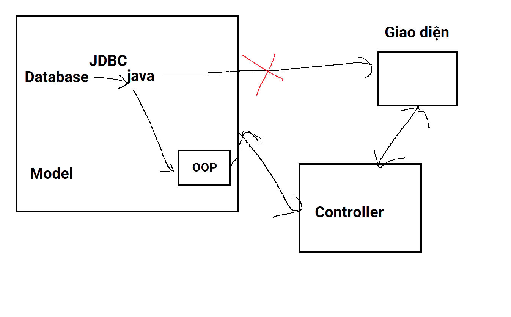

## Quản lí chuỗi quán cà phê

- Người quản lí
  + ql Nhân viên
  + Lịch làm
  + Doanh thu (biểu đồ)

- Quản lí nhân sự (Nhân viên, quản lí, khách hàng)
- Quản lí đồ uống
- Quản lí loại đồ uống
- Quản lí kho (Nhập hàng, xuất hàng)
- Quản lí đơn hàng (hoá đơn)
- Quản lí lịch làm
- Quản lí doanh thu
- Quản lí Cửa hàng 

- Quyền
 + Chủ cửa hàng
 + Quản lí
 + Nhân viên

Cảnh báo: Đồ uống sắp hết

+ Lịch làm:

+ Cho Nhân viên dky lịch làm, cho dky trùng lịch
+ Quản lí: Xét duyệt lịch làm
+ Đổi lịch làm, huỷ lịch làm

Doanh thu / lợi nhuận (biểu đồ) TỪNG NGÀY/ Từng giờ:
- Lương từng nhiên viên <- lịch làm
- Tiền nhập hàng <- quản lí kho (đồ uống)
- Tiền bán ra (Doanh thu) 
- Lợi nhuận: Doanh thu - vốn đầu tư

-------------------------------------------------
## Quản lí sinh viên của Trường DH

Áp dụng Java Swing và Java JDBC để làm ứng dụng
Quản lí sinh viên của Trường DH

+ Quản lí thông tin sinh viên
+ Quản lí khoa
+ Quản lí lớp học
+ Quản lí học phần
+ Quản lí điểm số sinh viên

+ Quản lí lịch học (Thời khoá biểu)
(Tự động xếp lịch học cho sinh viên)
+ Quản lí điểm rèn luyện
+ Quản lí nội trú/ ngoại trú

-------------------------------------------------

## Quản lí quán Net

Áp dụng Java Swing và Java JDBC để làm ứng dụng
Quản lí quán Net

+ Quản lí thiết bị
+ Quản lí khách hàng
 + Tài khoản
+ Quản lí thời gian sử dụng
+ Quản lí doanh thu
+ Quản lí oder đồ ăn thức uống
+ Quản lí ưu đãi (giảm)
+ Thống kê doanh thu (Biểu đồ)
+ Thống thời gian chơi của mỗi máy
+ Quản lí các trò chơi trong máy
+ Gửi mail tự động