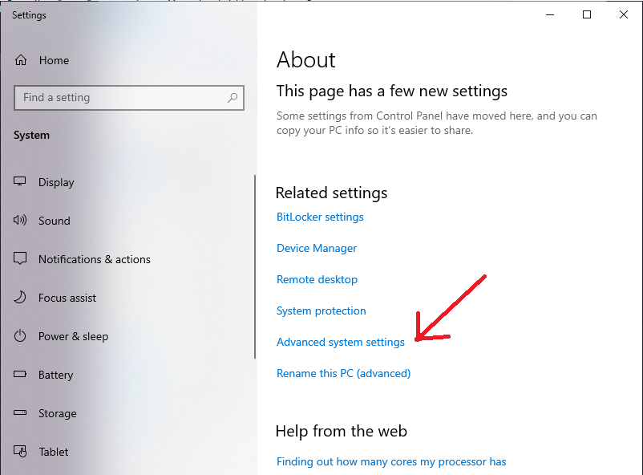

<div align="center">

# Hướng dẫn cài đặt JDK và eclipse để chạy Java

</div>

Xin chào các bạn, nếu bạnd đang muốn cài đặt java để học tập thì xem hướng dẫn bên dưới nhé.

Để cài đặt vào chạy chương trình java bản cần:

### 1. Cài đặt JDK
JDK là môi trường để chạy ngôn ngữ java.
Hiện có rất nhiều bản JDK nhưng theo kinh nghiệm của mình thì bản JDK8 là ổn định nhất.
Các bạn cóp thể tải JDK8 [Tại đây](https://app.downloadvn.com/8cwmfb7upg/xabRV5WHEzK6Q-wRDa3ZpQ/1694354582/jdk-8u45-windows-x64.exe)

Sau khi tải về các bạn tiến hành cài đặt bẳng cách mở file exe vừa tải.

Đoạn này thì cứ next hết nha, để mặc định các thông số của nó.

Sau khi hoàn thành các bạn kiểm tra copy đoạn mã bên dưới:

``` text
C:\Program Files\Java\jre1.8.0_45\bin
```

Tiếp đến mở file explorer bằng cách gõ window + E:

<div align="center">


Chuột phải vào **This PC** và chọn **properties**:
</div>

<div align="center">


</div>

Chọn **Advanced system settings**

<div align="center">


</div>

Chọn **Environment variables**

<div align="center">


</div>

Tại đây cần nhìn vào **Path** sau đó chọn **Edit**

<div align="center">


</div>

Tiếp theo hãy chọn **new**

<div align="center">


</div>

Tiếp theo thêm đoạn path bên dưới
```
C:\Program Files\Java\jre1.8.0_45\bin
```

Sau đó chọn **OK**

<div align="center">


</div>

Để kiểm tra bạn đã cài đặt thành công JDK chưa hãy gõ: window + R gõ cmd

Tiếp theo gõ:
```
java -version
```

Nếu kết quả như bên dưới thì bạn đã cài đặt thành công JDK

<div align="center">


</div>


