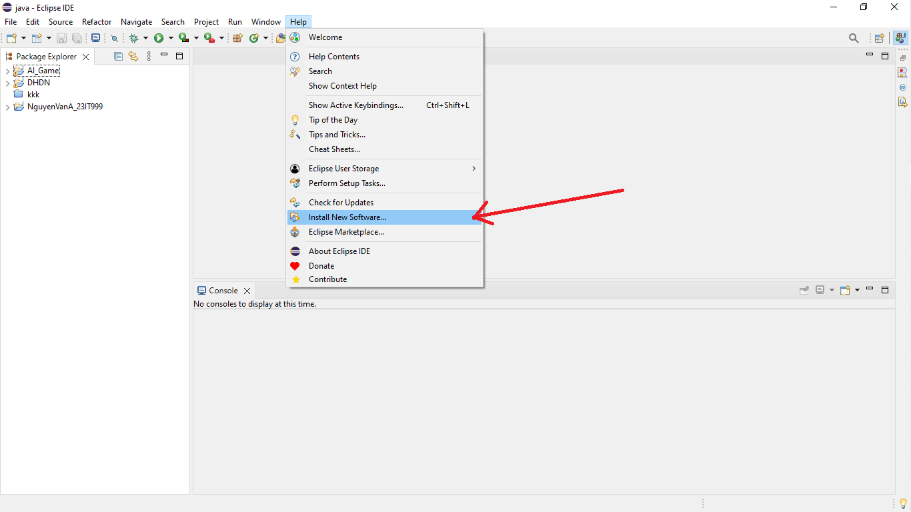
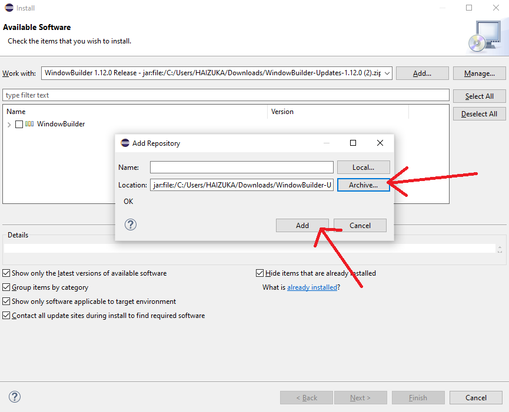
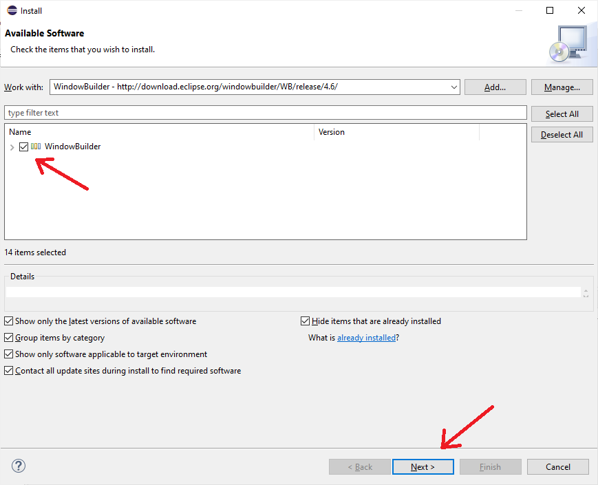
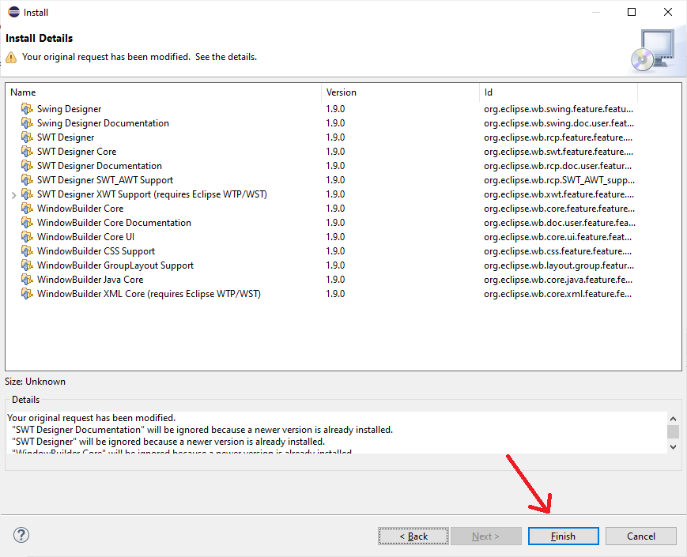
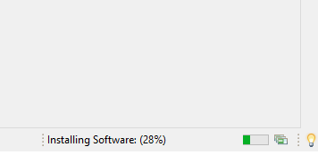
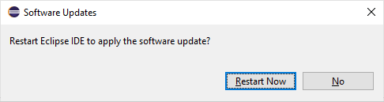

# Hướng dẫn cài dặt WindowBuilder cho Eclipse

Bước 1: Tại **Window Builder** tại https://eclipse.dev/windowbuilder/download.php

*Tải file zip xong giải nén*

Bước 2: Chọn **Help** -> **Install New Software** để tải về WindowBuilder

Bước 3: Chọn **Add** sau đó chọn **Local** và chọn fordel **WindowBuilder** bạn đã giải nén.

Bước 4: Tick và **WindowBuilder** sau đó chọn **Next** để tiến hành cài đặt

Chọn **Finish**

Bước 5: Chờ cài đặt WindowBuilder

Bước 6: Sau khi cài đặt xong thì restar

