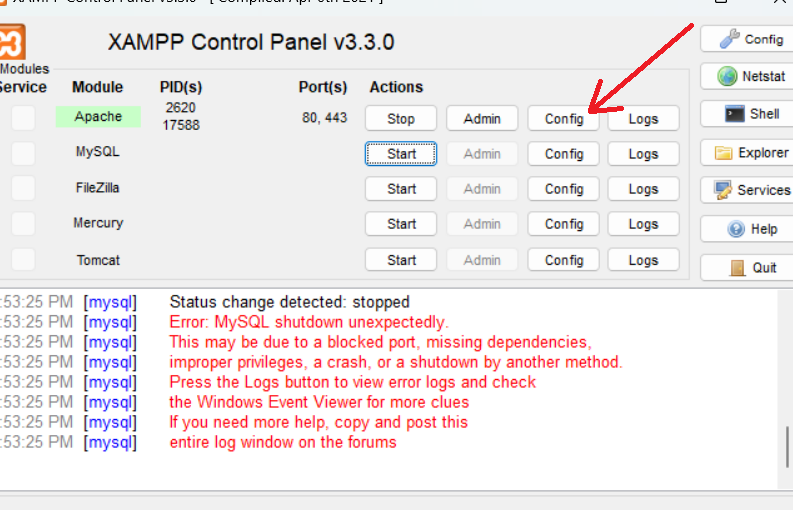

<div align="center">

# Một số lỗi thường gặp

</div>

## 1. Lỗi bộ nhớ đệm, không có nhập chuỗi 

Lỗi này thường xảy ra khi bạn nhập số, sau đó lại nhập chuỗi.
Ví dụ:

```java
public static void main(String[] args) {
    // TODO Auto-generated method stub
    Scanner sc = new Scanner(System.in);
    System.out.print("Nhập số: ");
    int n = sc.nextInt();
    System.out.print("Nhập chuỗi: ");
    String s = sc.nextLine();
    
    System.out.println("Số vừa nhập: " + n);
    System.out.println("Chuỗi vừa nhập: " + s);
}
```

Với đoạn code trên chúng ta cho phép nhập mỗi số, sau đó nhập một chuỗi, nhưng kết quả ở màn hình console là

```text
Nhập số: 2023
Nhập chuỗi: Số vừa nhập: 2023
Chuỗi vừa nhập: 
```

Chương trình không cho phép chúng ta dừng lại để nhập chuỗi, mà chạy tiếp phần lệnh phía dưới.

Lý do là khi bạn sử dụng **nextInt()** hoặc các phương thức tương tự, chúng đọc giá trị của kiểu dữ liệu mong muốn nhưng không đọc ký tự dòng mới *(newline character)* sau giá trị đó. Dấu newline này vẫn còn lại trong bộ đệm sau khi bạn nhập số và nhấn Enter.

Khi bạn sau đó gọi **nextLine()**, phương thức này sẽ đọc dòng mới chứa dấu newline từ bộ đệm và trả về một chuỗi trống (empty string), và sau đó bạn có thể nhập tiếp chuỗi hoặc văn bản khác mà bạn muốn.

**Cách giải quyết**

Để sửa lỗi trên chúng ta cần gọi hàm **nextLine()** giữa nhập số và chuỗi để có thể xoá *(newline character)* trong bộ nhớ điểm trước khi nhập chuỗi.

```java
public static void main(String[] args) {
    // TODO Auto-generated method stub
    Scanner sc = new Scanner(System.in);
    System.out.print("Nhập số: ");
    int n = sc.nextInt();
    
    sc.nextLine(); // Xoá bộ nhớ đệm
    
    System.out.print("Nhập chuỗi: ");
    String s = sc.nextLine();
    
    
    System.out.println("Số vừa nhập: " + n);
    System.out.println("Chuỗi vừa nhập: " + s);
}
```

Lúc này chương trình đã chạy đúng như mình mong muốn:

```text
Nhập số: 2023
Nhập chuỗi: HaiZuka
Số vừa nhập: 2023
Chuỗi vừa nhập: HaiZuka
```

## 2. Không gọi được phương thức

Trong ví dụ 2 phần [Tính kế thừa trong OOP](./oop-inheritance/) có định nghĩa một lớp **Cat** kế thừa lớp **Animal**, trong lớp **Cat** có đinh nghĩa một hàm **equalBreed** nhưng khi chạy chương trình bên dưới lại lôi:

```java
public static void main(String[] args) {
    Animal cat1 = new Cat("Cat 1", 1, "black", "male");
    Animal cat2 = new Cat("Cat 2", 2, "white", "female");
    boolean equals = cat1.equalBreed(cat2);
}
```

Lỗi ở hàm **equalBreed** cho dù mình đã định nghĩa nó.
Sai ở chỗ bạn gọi phương thức **equalBreed** trên đối tượng **cat1** và **cat2**, mặc dù **cat1** và **cat2** là kiểu **Animal**, nhưng phương thức **equalBreed** được định nghĩa trong lớp con **Cat**.

Để gọi phương thức equalBreed, bạn cần ép kiểu đối tượng **cat1** và **cat2** thành kiểu **Cat**, vì chỉ lớp **Cat** mới có phương thức **equalBreed**. Dưới đây là cách bạn có thể sửa lỗi:

```java
public static void main(String[] args) {
    Animal cat1 = new Cat("Cat 1", 1, "black", "male");
    Animal cat2 = new Cat("Cat 2", 2, "white", "female");
    
    boolean equals = ((Cat)cat1).equalBreed((Cat)cat2);
}
```

## 3. Lỗi so sánh chuỗi

Khi bạn so sánh 2 chuỗi hoàn toàn giống nhau nhưng kết quả 2 chuỗi đó vẫn khác nhau.
Ví dụ:
```java
public class Main {
	public static void main(String[] args) {
		Scanner sc = new Scanner(System.in);
		System.out.print("Nhập chuỗi 1: ");
		String s = sc.nextLine();
		System.out.print("Nhập chuỗi 2: ");
		String p = sc.nextLine();
		
		System.out.println(s == p);
	}
}
```
Màn hình console
```text
Nhập chuỗi 1: HaiZuka
Nhập chuỗi 2: HaiZuka
false
```

Rõ ràng chuỗi 1 và chuỗi 2 có cùng nội dùng nhưng khi so sánh thì kết quả s == p vẫn là sai

Lí do là vì **String** trong Java là kiểu dữ liệu tham chiếu, nên khi so sánh dùng **==** thì chỉ đúng khi hai **String** cùng tham chiếu đến địa chỉ bộ nhớ.

**Cách giải quyết**
Bạn hãy sử dụng **equals()** để so sánh 2 String trong java. Hàm **equals()** sẽ so sánh nội dung của hai chuỗi.

```java
public class Main {
	public static void main(String[] args) {
		Scanner sc = new Scanner(System.in);
		System.out.print("Nhập chuỗi 1: ");
		String s = sc.nextLine();
		System.out.print("Nhập chuỗi 2: ");
		String p = sc.nextLine();
		
		System.out.println(s.equals(p));
	}
}
```

```text
Nhập chuỗi 1: HaiZuka
Nhập chuỗi 2: HaiZuka
true
```

# 4. Lỗi khi cài đặt Window Builder

## 4.1 lỗi file
Nếu bạn tạo JFrame mà lỗi như bên dưới:

<div align="center"></div>

Bạn hãy xoá file **module-info.java** trong **src**

## 4.2 Không mở được tag design

Nếu bạn mở tag design mà màn hình hiện thị như bên dưới chứng tỏ bạn đang gặp lỗi.

<div align="center"></div>

Để sửa lỗi các bạn làm theo các bước sau:
Chọn **Help** -> **Eclipse Makerplace**

<div align="center"></div>


Tại giao diện hiện thị chọn tag **Installed**, kéo xuống 2 phần **Window Builder** và đổi thành **update** và chọn **Finish** để tiến hành cập nhật **WindowBuilder**

<div align="center"></div>

Cần chờ một xíu để cập nhật, sau khi cập nhập xong thì **Eclipse** sẽ yêu cầu **restart**

# 5. Lỗi khi cài đặt XamPP

## 5.1 Lỗi trùng port

<div align="center"></div>

Nếu bạn bị lỗi như trên hãy xử lí như sau:

**Bước 1**: Chọn vào config ở phần Apache, **chọn Apache(httpd.conf)**
<div align="center"></div>

**Tìm phần nôi dung:**

```text
Listen 80
```
và đổi thành

```text
Listen 8090
```

**Tìm phần nội dung:**

```text
ServerName localhost:80
```

và đổi thành

```text
ServerName localhost:8080
```

Tiến hành lưu lại file **httpd-ssl.conf**

**Bước 2**: Chọn vào cofig ở phần Apache chọn **Apache (httpd-ssl.conf)**

**Tìm phần nội dung:**

```text
Listen 443
```

và đổi thành

```text
Listen 4433
```

**Tìm phần nội dung:**

```text
<VirtualHost _default_:443>

ServerName localhost:443
```

và đổi thành

```text
<VirtualHost _default_:4433>

ServerName localhost:4433
```
Tiến hành lưu file **httpd-ssl.conf**

Khởi động lại **Xampp**
