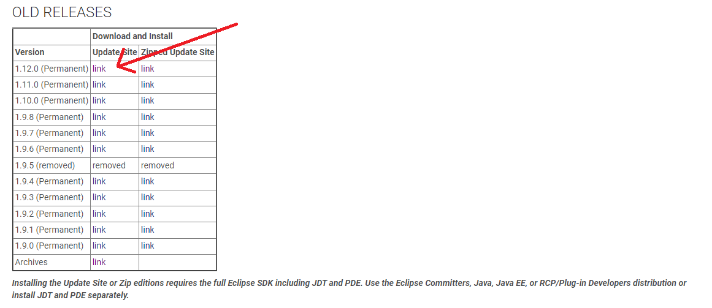
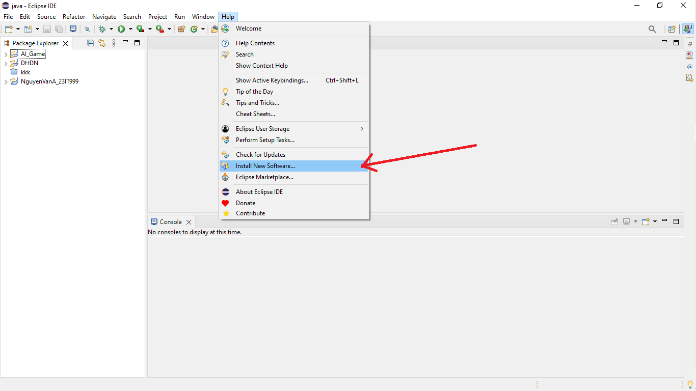
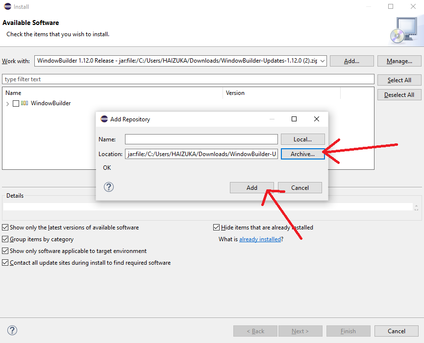
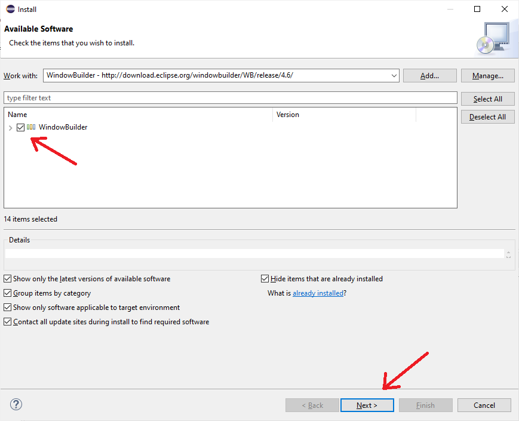
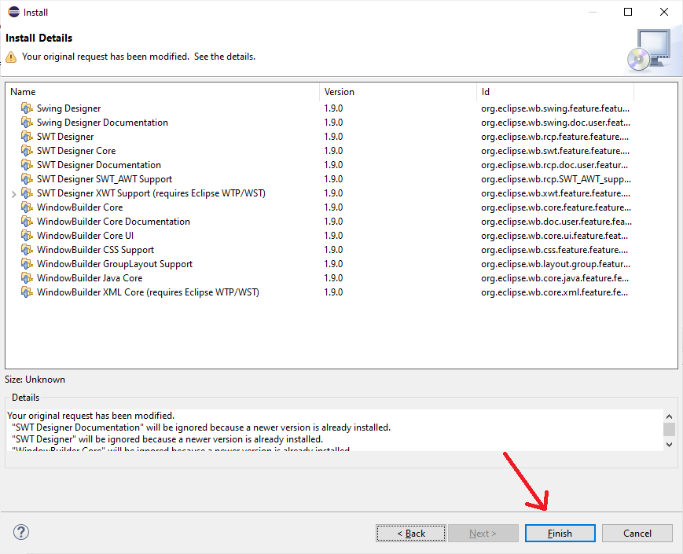
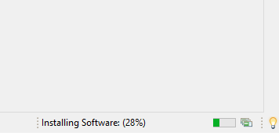
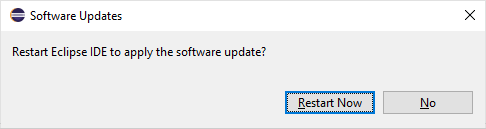
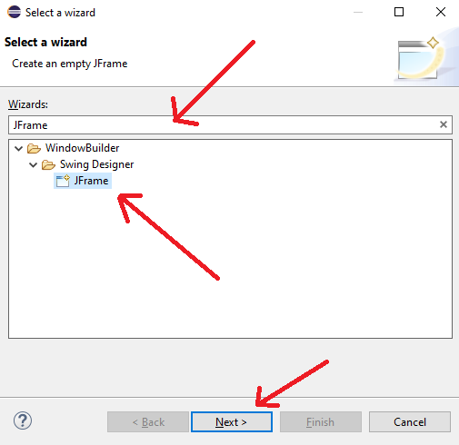
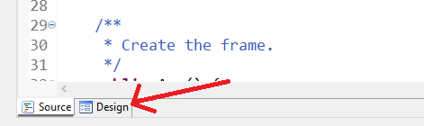
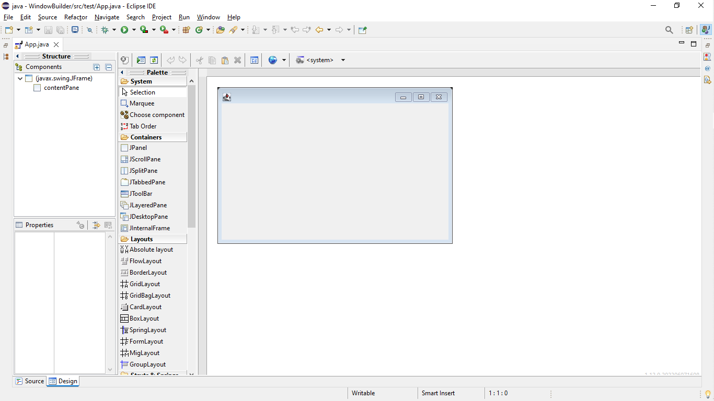

# Hướng dẫn cài dặt WindowBuilder cho Eclipse

Bước 1: Tải **Window Builder** tại https://eclipse.dev/windowbuilder/downloads/

*Tải file zip xong, **KHÔNG** cần giải*

Bước 2: Chọn **Help** -> **Install New Software** để tải về WindowBuilder

Bước 3: Chọn **Add** sau đó chọn **Archive** và chọn file zip **WindowBuilder** bạn đã tải xuống.

Bước 4: Tick và **WindowBuilder** sau đó chọn **Next** để tiến hành cài đặt

Chọn **Finish**

Bước 5: Chờ cài đặt WindowBuilder

Bước 6: Sau khi cài đặt xong thì restart.

# Kiểm tra đã cài đặt

Để kiểm tra xem bạn đã cài đặt thành công và Window Builder đã hoạt động chưa các bạn làm như sau:

Tạo **Java Project** và **package** như trước đây các bạn vẫn hay tạo.

Chuột phải vào package của bạn, chọn **new** -> **Other...**
Nhập **JFrame** vào chọn JFrame

Tiếp theo đặt tên cho class và tiến hành hoàn tất tạo class.

Tại giao diện class, hãy chọn vào tag **design** ở phía dưới bên trái.

Nếu giao diện xuất hiện như bên dưới thì bạn đã cài đặt thành công:

# Gặp lỗi

Nếu gặp lỗi các bạn có thể xem các lỗi thường gặp [Tại đây](./bugs.md#4-lỗi-khi-cài-đặt-window-builder)
