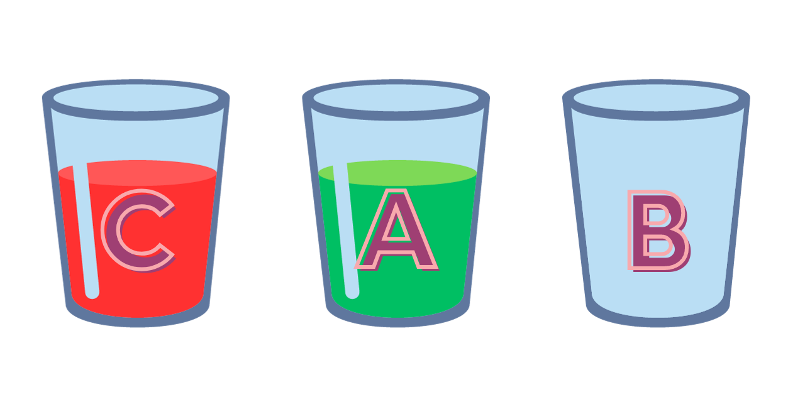

# Khai báo biến, nhập xuất dữ liệu và tính toán cơ bản

### Ví dụ 1:
Nhập vào hai số nguyên a và b, tính và in ra tổng, hiệu, tích và thương của 2 số đó.

<details>
<summary> <strong>🟢 Bài giải mẫu 📚</strong></summary>

```java
import java.util.Scanner;
public class VKU {
	public static void main(String[] args) {
		int a, b;
		Scanner sc = new Scanner(System.in);
		
		System.out.print("Nhập A = ");
		a = sc.nextInt();
		System.out.print("Nhập B = ");
		b = sc.nextInt();
		
		//Xu li
		System.out.println("A = " + a);
		System.out.println("B = " + b);
		System.out.println("A + B = " + (a + b));
		System.out.println("A - B = " + (a - b));
		System.out.println("A * B = " + (a * b));
		System.out.println("A / B = " + (a / (float)b));
	}
}
```

</details>
<br>

Để nhập dữ liệu từ bàn phím thì các bạn sử dụng class Scanner từ package java.util. (Nhớ import thư viện này vào nhé, nên áp dụng **ctrl + space** để tự import thư viện luôn)

Lưu ý là trong ngôn ngữ Java, việc chia 2 số có kiểu đều là số nguyên thì chỉ trả lại phần nguyên của kết quả thôi.

Ví dụ:
```Java
int a = 5;
int b = 2;
System.out.println(a / b);
```

Thì kết quả chỉ trả về 2 thì vì kết quả đúng là 2.5

Để giải quyết vấn đề này thì các bạn có nhiều cách:
Cách 1: Đổi kiểu dữ liệu của 1 trong 2 biến thành kiểu số thực (float, double)
Cách 2: Trong lúc tính toán có thể áp dụng kỹ thuật ép kiểu 1 trong 2 biến a và b thành kiểu số thực.
Ví dụ:
```java
int a = 5;
int b = 2;
System.out.println((float)a / b);
System.out.println(a / (float)b);
```

### Ví dụ 2:
Nhập vào bán kính của một hình tròn, tính và in ra chu vi và diện tích của hình tròn đó.

<details>
<summary> <strong>🟢 Bài giải mẫu 📚</strong></summary>

```java
import java.util.Scanner;

public class Hello {
	public static void main(String[] args) {
		Scanner sc = new Scanner(System.in);
		System.out.print("Nhập bán kính của hình tròn: ");
		double r = sc.nextFloat();
		double p = 2 * Math.PI * r;
		double s = Math.PI * r * r;
		System.out.println("Chu vi của hình tròn là: " + p);
		System.out.println("Diện tích của hình tròn là: " + s);
	}
}
```

</details>
<br>

Trong ngôn ngữ Java để lấy giá trị Pi các bạn sử dụng **Math.PI**

### Ví dụ 3
Nhập và chiều dài và chiều rộng của một hình chữ nhật, tính và in ra chu vi và diện tích của hình chữ nhật đó.

<details>
<summary> <strong>🟢 Bài giải mẫu 📚</strong></summary>

```Java
package test;

import java.util.Scanner;

public class Hello {
	public static void main(String[] args) {
		Scanner sc = new Scanner(System.in);
		System.out.print("Nhập chiều dài của HCN: ");
		int length = sc.nextInt();
		System.out.print("Nhập chiều rộng của HCN: ");
		int width = sc.nextInt();
		
		System.out.println("Chu vi của HCN là " + (2 *(length + width)));
		System.out.println("Diện tích của HCN " + (length * width));
	}
}
```

</details>
<br>

### Ví dụ 4:
Nhập và 3 cạnh của 1 tam giác, tính và in ra chu vi và diện tích của tam giác đó.

Gợi ý tính diện tích: Hãy áp dụng công thức [Heron](https://vi.wikipedia.org/wiki/Công_thức_Heron) để tính diện tích khi biết ba cạnh của tam giác.

<details>
<summary> <strong>🟢 Bài giải mẫu 📚</strong></summary>

```java
package DHDN;

import java.util.Scanner;

public class VKU {
	public static void main(String[] args) {
		Scanner sc = new Scanner(System.in);
		System.out.print("Nhập vào độ dài canh thứ nhất: ");
		float side1 = sc.nextFloat();
		System.out.print("Nhập vào độ dài canh thứ hai: ");
		float side2 = sc.nextFloat();
		System.out.print("Nhập vào độ dài canh thứ ba: ");
		float side3 = sc.nextFloat();
		
		System.out.println("Chu vi của HCN là: " + (side1 + side2 + side3));
		
		float p = (side1 + side2 + side3) / 2;
		float area = (float) Math.sqrt(p * (p - side1) * (p - side2) * (p - side3));
		
		System.out.println("Diện tích của HCN là: " + area);
	}
}

```

</details>
<br>

### Ví dụ 5:
Nhập tuổi của một sinh viên tính đến năm 2023, hãy tính và in ra năm sinh viên đó.

<details>
<summary> <strong>🟢 Bài giải mẫu 📚</strong></summary>

```java
package DHDN;

import java.util.Scanner;

public class VKU {
	public static void main(String[] args) {
		Scanner sc = new Scanner(System.in);
		System.out.print("Nhập vào tuổi của sinh viên: ");
		int age = sc.nextInt();
		System.out.println("Năm sinh của sinh viên đó là " + (2023 - age));
	}
}
```

</details>
<br>

### Ví dụ 6:
Nhập vào một số nguyên N, hãy in ra chữ số cuối cùng của số đó.

Gợi ý: Chữ số cuối cùng của só n chính là kết quả của phép chia lấy phần dư của n cho 10.

Ví dụ, để lấy chữ số cuối cùng của 123, ta lấy 123 chia cho 10 và lấy phần dư, 123 chia 10 được 12 dư 3, vậy chữ số cuối cùng của 123 là 3.

Trong Java, phép chia lấy dư được biểu diễn bằng ký tự **%**.
Ví dụ 5 % 2 = 1, 123 % 10 = 3,...

Lưu ý cần lấy trị tuyệt đối **Math.abs()** để tránh trường hợp n < 0


<details>
<summary> <strong>🟢 Bài giải mẫu 📚</strong></summary>

```java
import java.util.Scanner;

public class Hello {
	public static void main(String[] args) {
		Scanner sc = new Scanner(System.in);
		System.out.print("N = ");
		int n = sc.nextInt();
		System.out.println("Chữ số cuối cùng của " + n + " là " + Math.abs(n % 10));
	}
}

```
</details>
<br>

### Ví dụ 7
Nhập vào một số nguyên N có ít nhất 2 chữ số (lớn hơn 9 hoặc nhỏ hơn -9). In ra chữ số gần cuối của N.
Ví dụ N = 123, chữ số gần cuối là 2. 
Ví dụ N = 1234, chữ số gần cuối là 3.
Ví dụ N = 928743, chữ số gần cuối là 4.
Ví dụ N = -24381, chữ số gần cuối là 8.

<details>
<summary> <strong>🟢 Bài giải mẫu 📚</strong></summary>

```java
package DHDN;

import java.util.Scanner;

public class VKU {
	public static void main(String[] args) {
		Scanner sc = new Scanner(System.in);
		System.out.print("Nhập N: ");
		int n = sc.nextInt();
		System.out.println("Số gần của của N là " + Math.abs(n % 100) / 10);
	}
}
```

</details>
<br>

### Ví dụ 8
Nhập vào tên của bạn, hãy in ra độ dài tên của bạn.
*Gợi ý*
Trong java để khai báo một chuỗi biến bạn có thể sử dụng **String**.

Để nhập một chuỗi các bạn sử hàm nextLine() trong class Scanner.

Để lấy độ dài của một chuỗi bạn sử dụng **.length()**

Ví dụ để lấy độ dài của chuỗi **s** các bạn dùng **s.length()**

<details>
<summary> <strong>🟢 Bài giải mẫu 📚</strong></summary>

```java
package DHDN;

import java.util.Scanner;

public class VKU {
	public static void main(String[] args) {
		Scanner sc = new Scanner(System.in);
		System.out.print("Nhập tên của bạn: ");
		String name  = sc.nextLine();
		System.out.println("Độ dài tên của bạn là: " + name.length());
	}
}
```

</details>
<br>

### Ví dụ 9
Nhập vào 2 số nguyên a và b, (b khác 0) hãy in ra kết quả của a / b như bên dưới với điều khiện chỉ sử dụng hàm in một lần.

Ví dụ: a = 5, b = 2, kết quả là 5 / 2 = 2.5

Ví dụ: a = 10, b = 3, kết quả là 10 / 3 = 3.3333333

<details>
<summary> <strong>🟢 Bài giải mẫu 📚</strong></summary>

```java
package DHDN;

import java.util.Scanner;

public class VKU {
	public static void main(String[] args) {
		Scanner sc = new Scanner(System.in);
		System.out.print("Nhập A: ");
		int a = sc.nextInt();
		System.out.print("Nhập B: ");
		int b = sc.nextInt();
		System.out.println(a + " / " + b + " = " + ((float)a / b));
	}
}
```

</details>
<br>

### Ví dụ 10
Nhập vào 1 ký tự thường (từ 'a' đến 'y'), hãy in ra ký tư liền sau ký tự vừa nhập.

Ví dụ nhập ch = 'a' thì kết quả là b

Ví dụ nhập ch = 'm' thì kết quả là n

Ví dụ nhập ch = 'y' thì kết quả là z

<details>
<summary> <strong>🟢 Bài giải mẫu 📚</strong></summary>

```
package DHDN;

import java.util.Scanner;

public class VKU {
	public static void main(String[] args) {
		Scanner sc = new Scanner(System.in);
		System.out.print("Nhập ký tự: ");
		char ch = sc.next().charAt(0);
		char ch2 = (char) (ch + 1);
		System.out.println("Ký tự sau ký tự " + ch + " là " + ch2);
	}
}
```

</details>
<br>

### Ví dụ 11
Nhập vào 2 số nguyên a và b, hãy hoán đổi giá trị của a và b.
Ví dụ nhập a = 7, b = 5. Sau khi thực hiện chương trình thì a = 5, b = 7.

Thoạt nhìn, nhiều người sẽ có suy nghĩ làm như sau:
```Java
a = b;
b = a;
```

Nhưng khoan đã, chương trình trên là sai. Sau câu lệnh **a = b** thì giá trị ban đầu của **a** sẽ bị mất đi,  lúc thực hình dòng lệnh **b = a** thì lúc này b sẽ gán bằng giá trị mới của **a** chứ không phải giá trị ban đầu nữa.

Ví dụ a = 7, b = 5, sau dòng lệnh a = b thì giá trị của a sẽ bằng giá trị của b là 5, lúc này giá trị của cả a và b đều bằng 5, sau khi thực hiện câu lệnh b = a, thì lúc này b vẫn sẽ bằng 5, bằng giá trị mà a đã gán trước đó.

Như vậy nếu ta làm như trên thì kết quả sẽ bị sai.

#### Cách hoán đổi 2 giá trị của 2 biến

Để dễ hình dung về bài toán này, mình sẽ lấy một ví dụ thực tế.

Ví dụ bạn đang có 2 cốc nước, cốc nước A chứa nước màu đỏ, cốc nước B chưa nước màu xanh. Bạn muốn hoán đổi nước trong 2 cốc đó thì phải làm như thế nào?

<div align="center">

</div>

Chúng ta đều hiểu là phải đổ nước từ cốc A sang cốc B và từ cốc B sang cốc A, nhưng ban đầu, trong cốc A và cốc B đều đang có nước, nên việc thực hiện công việc trên sẽ khó khăn.

Đúng như suy nghĩ của bạn, chúng ta cần thêm 1 cốc nước C (không có nước) làm cốc trung gian nữa.

<div align="center">

</div>

Ta sẽ thực hiện hoán đổi bằng 3 bước sau:

**Bước 1: đổi nước cốc A sang cốc C**

<div align="center">

</div>

**Bước 2: đổi nước cốc B sang cốc A**

<div align="center">

</div>

**Bước 3: đổi nước cốc C sang cốc B**

<div align="center">

</div>

Như vậy ta đã hoán đổi được nước trong cốc A và cốc B.

<div align="center">

</div>

Qua ví dụ trên chúng ta thấy để hoán đổi giá trị của 2 biến, cần có thêm 1 biến phụ sẽ dễ hơn rất nhiều (Vẫn có cách không cần dùng biến phụ). Code hoán đổi giá trị của biến a và biến b như sau:

```Java
c = a;
a = b;
b = c;
```

<details>
<summary> <strong>🟢 Bài giải mẫu 📚</strong></summary>

```Java
package test;

import java.util.Scanner;

public class Hello {
	public static void main(String[] args) {
		Scanner sc = new Scanner(System.in);

		// Nhập a, b
		System.out.print("Nhập A: ");
		int a = sc.nextInt();
		System.out.print("Nhập A: ");
		int b = sc.nextInt();

		// In ra giá trị trước khi hoán đổi
		System.out.println("Giá trị ban đầu");
		System.out.println("A = " + a);
		System.out.println("B = " + b);
		
		// Hoán đổi giá trị của biến a và biến b
		int c = a;
		a = b;
		b = c;
		
		// In ra giá trị sau khi hoán đổi
		System.out.println("Giá trị sau khi hoán đổi");
		System.out.println("A = " + a);
		System.out.println("B = " + b);
		
	}
}

```
</details>
<br>

### Ví dụ 12
Nhập vào 2 số nguyên a và b, hãy hoán đổi giá trị của a và b **mà không dùng biến phụ**
Ví dụ nhập a = 7, b = 5. Sau khi thực hiện chương trình thì a = 5, b = 7.

Để hoán đổi không cần biến phụ chúng ta có thể làm như sau:
```java
a = a + b; 
b = a - b; 
a = a - b;
```

a = a + 1: Lúc này a = tổng của a và b, b vẫn mang giá trị b ban đầu

b = a - b: do a bây giờ là tổng của a và b, nếu khi a  - b sẽ trả về a ban đầu, lúc này a mang giá trị tổng của a và b, còn b mang giá trị của a ban đầu

a = a - b: tổng của a và b trừ đi a ban đầu sẽ ra b ban đầu

Như thế sau khi thực hiện 2 câu lệnh trên thì a mang giá trị b ban đầu và b mang giá trị a ban đầu


<details>
<summary> <strong>🟢 Bài giải mẫu 📚</strong></summary>

```java
package DHDN;

import java.util.Scanner;

public class VKU {

	public static void main(String[] args) {
		Scanner sc = new Scanner(System.in);

		// Nhập a, b
		System.out.print("Nhập A: ");
		int a = sc.nextInt();
		System.out.print("Nhập A: ");
		int b = sc.nextInt();

		// In ra giá trị trước khi hoán đổi
		System.out.println("Giá trị ban đầu");
		System.out.println("A = " + a);
		System.out.println("B = " + b);
		
		// Hoán đổi giá trị của biến a và biến b
		a = a + b;
		b = a - b;
		a = a - b;
		
		// In ra giá trị sau khi hoán đổi
		System.out.println("Giá trị sau khi hoán đổi");
		System.out.println("A = " + a);
		System.out.println("B = " + b);
		
	}

}

```
</details>
<br>