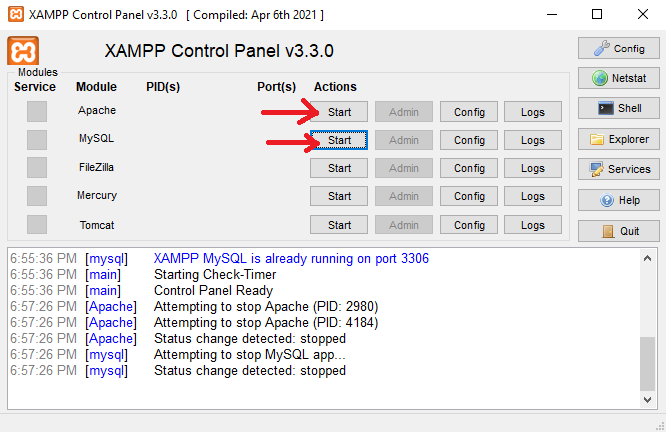
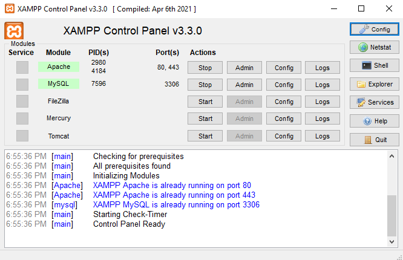
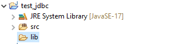
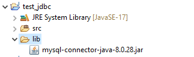
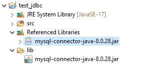

<div align="center">

# Hướng dẫn cài đặt JDBC với MySQL (xampp) trong Java

</div>

JDBC, hay Java Database Connectivity, là một API (Application Programming Interface) trong ngôn ngữ lập trình Java được sử dụng để kết nối và tương tác với cơ sở dữ liệu. Trong bài này, mình sẽ hướng dẫn các bạn cài đặt JDBC với MySQL, nếu bạn nào đang dùng SQL server thì có thể tìm hiểu thêm, nhưng theo mình thì việc cài đặt SQL Server kết nối với jdbc khá phức tạp, khuyến khích các bạn dùng xampp (MySQl) để học tập.

## Cài đặt xampp
Các bạn cài đặt xampp tại trang chủ [Xampp Download](https://www.apachefriends.org/download.html)
Phần này khá dễ. Sau khi cài đặt xong các bạn mở xampp chọn **start** ở **Apache** và **MySql**

<div align="center"></div>

Nếu xampp hiện như bên dưới, không có lỗi đỏ thì bạn đã cài đặt xampp thành công.

<div align="center"></div>

Nếu gặp lỗi, hãy xem qua mội số lỗi thường gặp [Tại đây](./bugs.md)

## Cài đặt JDBC và kết nối đến Ecipse
### Cài đặt JDBC
Cài đặt JDBC *mysql-connector-java-8.0.28.jar* [Tại đây](./assets/jdbc/mysql-connector-java-8.0.28.jar)

### Kết nối JDBC đến Ecipse
Các bạn tạo sẵn 1 java project trong ecipse.
Trong project tạo 1 folder tên là **lib** (hoặc có thể tên khác)

<div align="center"></div>

Copy và paste file **mysql-connector-java-8.0.28.jar** vào folder **lib**

<div align="center"></div>

Tiếp theo chọn vào file **mysql-connector-java-8.0.28.jar**, Chụp phải -> chọn **Build path** -> Chọn **Add to Build Path**

Lúc này project sẽ có cấu trúc như thế này:
<div align="center"></div>

### Kiểm tra kết nối
Tạo 1 class có nội dung như sau:
```java
package model;

import java.sql.*;

public class ConnectJDBC {
	public static Connection getConnection() {
		Connection conn = null;
		try{ 
			   String userName = "root";
			   String password = "";
			   String DatabaseName = "test";
			   String url = "jdbc:mysql://localhost/" + DatabaseName;
			   Class.forName("com.mysql.cj.jdbc.Driver");
			   conn = DriverManager.getConnection(url, userName, password);
			   System.out.println("Ok");
		} catch (Exception e) {
			// TODO: handle exception
			e.printStackTrace();
		}
		return conn;
	}
	
	public static void main(String[] args) {
		ConnectJDBC.getConnection();
	}
}

```

Nếu màn hình console chỉ hiện chữ "OK" thì bạn đã hoàn tất mọi thứ. Lưu ý là cần start Apache và MySql của xampp trước khi chạy code.
