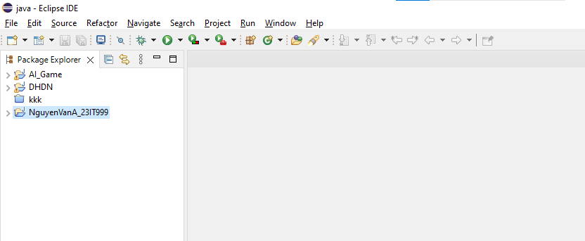
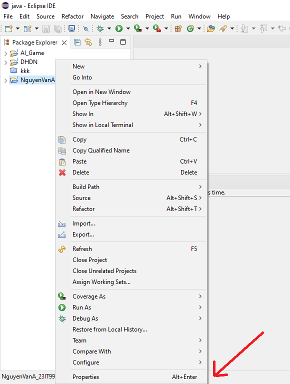
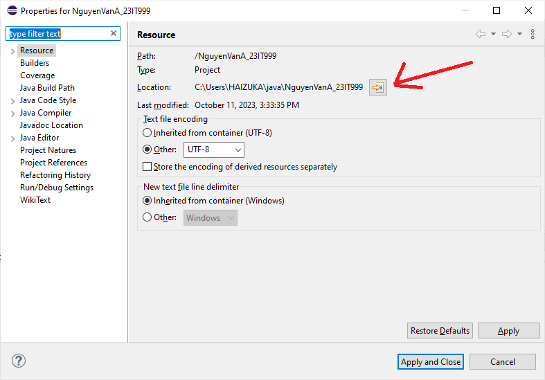
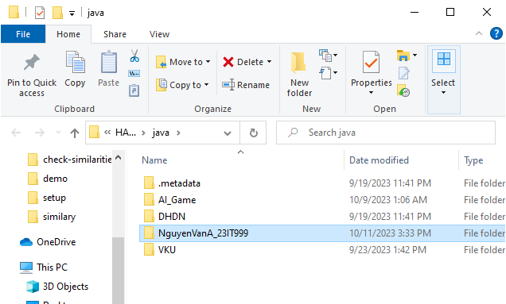
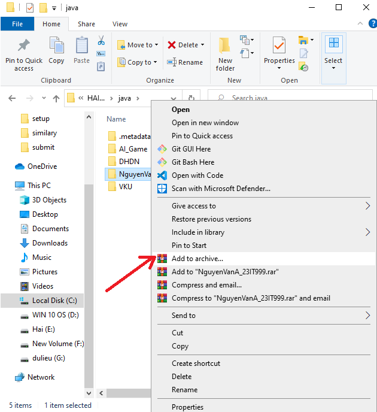
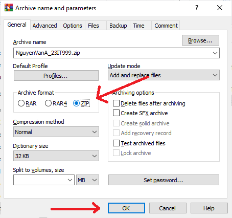
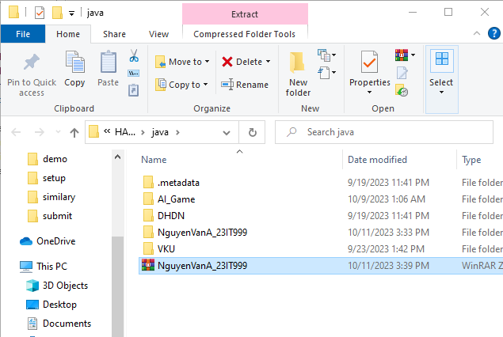

# Hướng dẫn nộp bài tập Java

Để thuận tiện cho việc xem cũng như chạy code của các bạn thì các bạn cần phải gửi mã nguồn đúng cách.

## Cách mở folder chứa project

Cách mở folder chứa java project của các bạn trên file explorer:

Bước 1: Mở eclipse và chọn vào project của các bạn

Bước 2: Chuổt phải chọn **properties** hoặc dùng tổ hợp **alt+enter**:

Bước 3: Chọn vào biểu tượng open explorer

Lúc này thì project của các bạn đã được mở trên explorer

## Các nén folder file zip

Sau khi đã mở được folder chứa project của bạn thì bạn có thể nén folder file zip của bạn bằng cách bước như sau:

Bước 1: Ch­ọn folder, chuột phải sau đó chọn **Add to Archive**

Bước 2: Tạo **General** Chọn **zip** sau đó chọn **Ok**

Lúc này bạn đã thành công nén file zip.  Sử dụng file này để nộp bài.

Nếu bạn chưa thể thực hiện bước 1 thì có thể bạn chưa cài đặt **Winrar**, hãy tiến thành cài đặt và làm theo hướng dẫn.