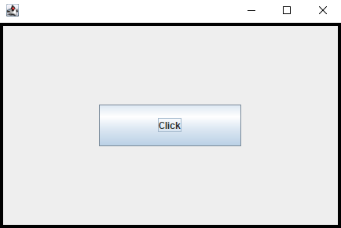
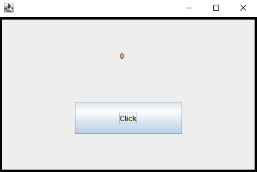
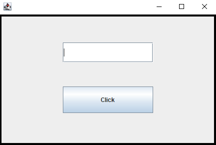
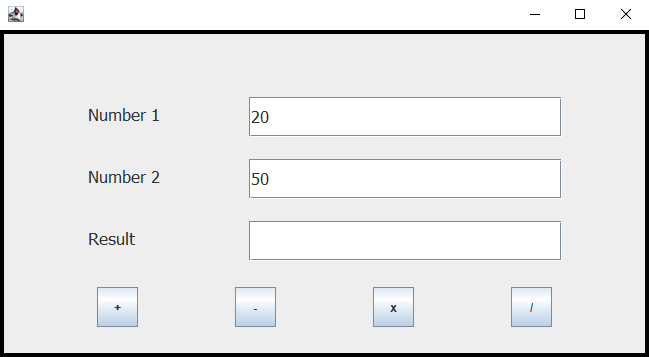
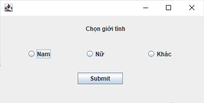
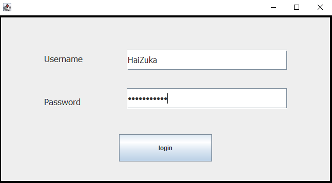
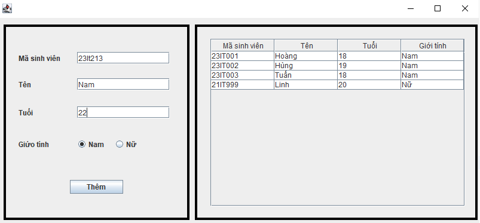

# Thiết kế giao diện bằng java swing

### Ví dụ 1

Thiết kế giao diện cho một **JButton** click, khi bấm vào thì sẽ in ra chữ "Hello World" ở màn hình console.

### Ví dụ 2

Thiết kế giao diện cho một **JButton** click và một **JLabel** label, khi bấm vào button thì giá trị ở lable tăng lên 1 đơn vị

### Ví dụ 3

Thiết kế giao diện cho một **JButton** click và một **JtextField** text, khi bấm vào button thì in ra giá trị đã nhập ở text

### Ví dụ 4

Thiết kế giao diện như hình bên dưới, cho phép nhập vào 2 số nguyên và tính kết quả của từng phép tính tương ứng khi bấm nút +, -, *, /

### Ví dụ 5

Thiết kế giao diện như hình bên dưới cho phép được chọn. Mặc định ban đầu chọn 'Nữ', chỉ cho phép chọn 1 trong 3 lựa chọn. Bấm submit sẽ hiện giới tính đã chọn ở màn hình console.

Gợi ý: Dùng **JRadioButton** để tạo các lựa chọn và dùng **ButtonGroup** để nhóm 3 radio thành 1 nhóm, lúc này chỉ cho phép chọn 1 trong 3 radio.

### Ví dụ 6

Thiết kế giao diện như hình bên dưới, Chú ý password nên để là **JPasswordField**. Khi login thì in ra thông tin đăng nhập ra màn hình console.

### Ví dụ 7

Tạo class **Student** dùng để biểu diễn những sinh viên. Bao gồm:
- Các thuộc tính:
    -   **masv**: String, đại diện cho mã sinh viên, nó là duy nhất.
    -   **name**: String, đại diện cho tên của sinh viên.
    -   **age**: int, đại diện cho tuổi của sinh viên.
- Các phương thức:
    -   Các hàm khởi tạo: Khởi tạo mặc định, khởi tạo có thuộc tính.
    - Các hàm getter(), setter(), toString()

Tạo interface **IManager** gồm các phương thức:
- void **add(Student s)**;
- ArrayList\<Student> **findAll()**

Tạo class **StudentManager** implement interface **IManager** dùng để quản li sinh viên

Thiết kế giao diện như hình bên dưới, cho phép nhập dữ liệu và hiện thị tất cả dữ liệu đã nhập bên table (Dùng JTable để thiết kế)

