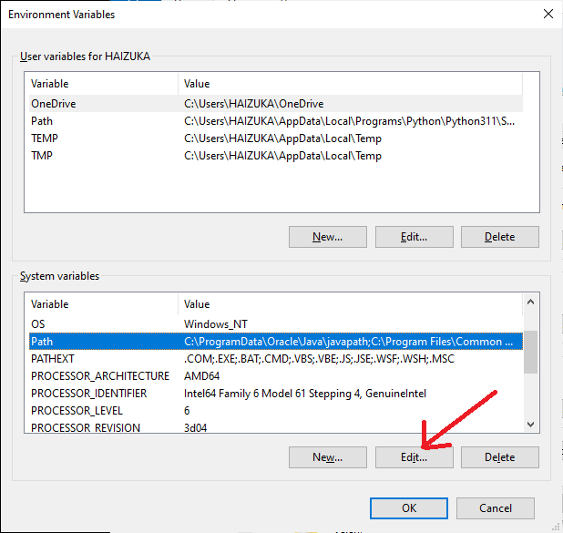
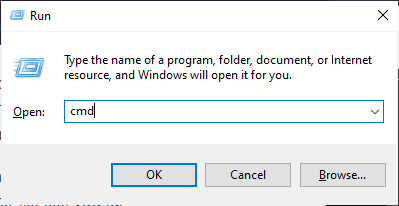
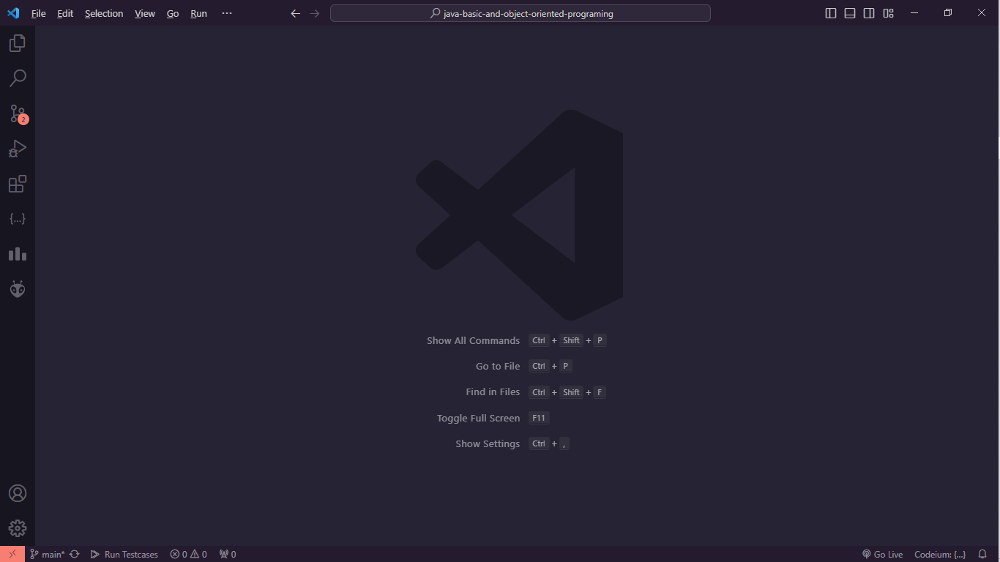
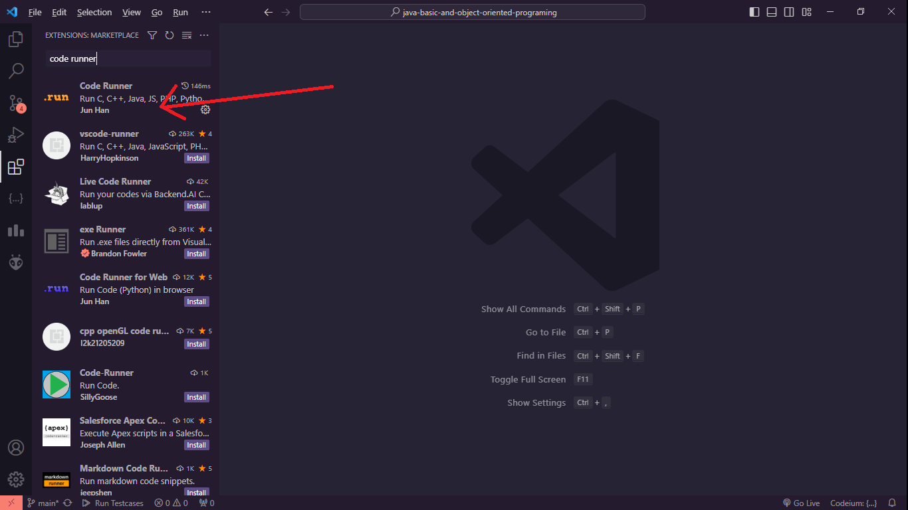
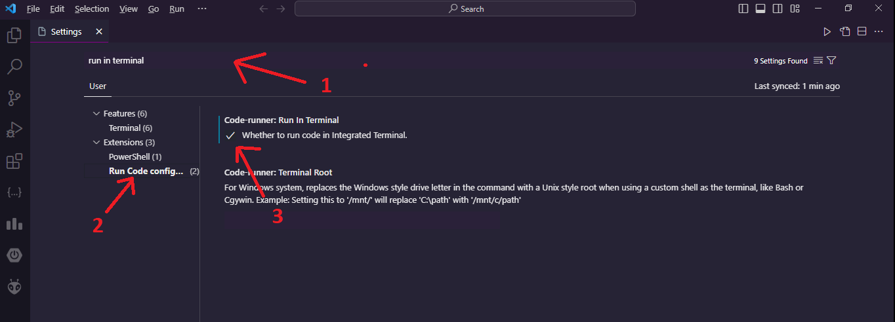
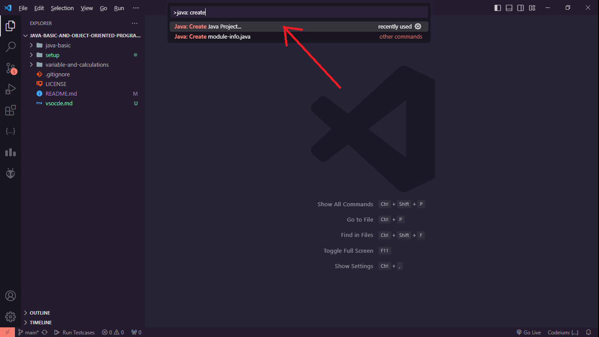
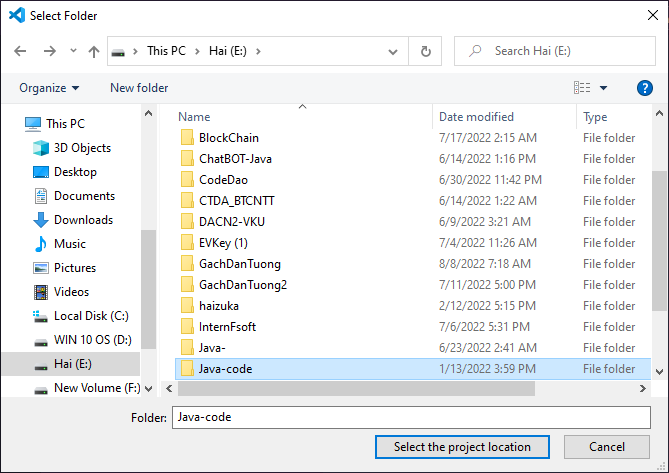
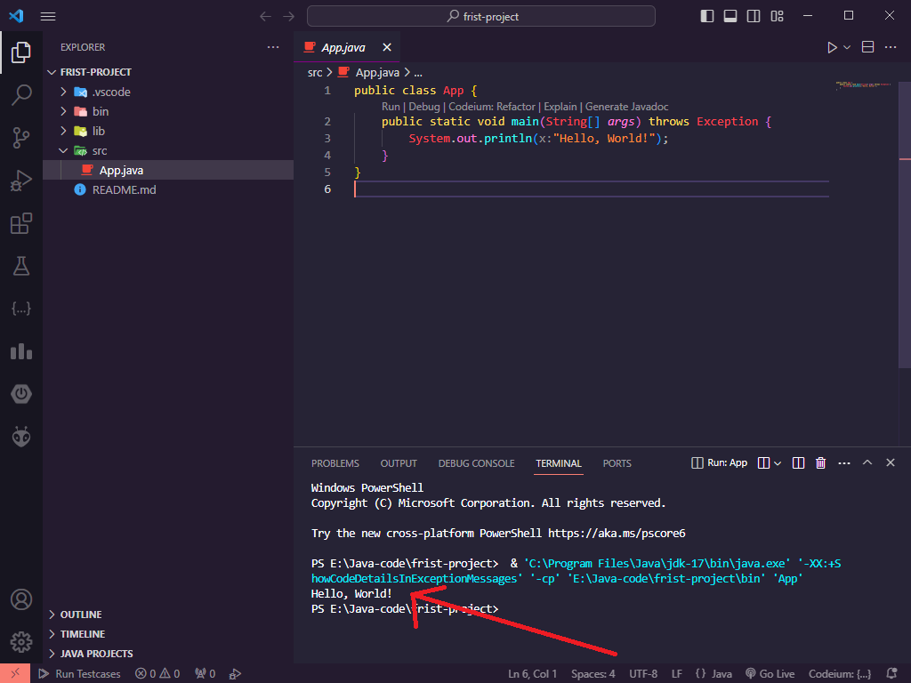

<div align="center">

# Hướng dẫn cài đặt JDK và Visual Studio Code

</div>

Xin chào các bạn, nếu bạnd đang muốn cài đặt java để học tập thì xem hướng dẫn bên dưới nhé.

Để cài đặt vào chạy chương trình java bản cần:

### 1. Cài đặt JDK
JDK là môi trường để chạy ngôn ngữ java.
Hiện có rất nhiều bản JDK nhưng theo kinh nghiệm của mình thì bản JDK8 là ổn định nhất.
Các bạn cóp thể tải JDK8 [Tại đây](https://app.downloadvn.com/8cwmfb7upg/F-_-F1ml0ZEiPGnDvAifTw/1694495852/jdk-8u45-windows-x64.exe)

Sau khi tải về các bạn tiến hành cài đặt bẳng cách mở file exe vừa tải.

Đoạn này thì cứ next hết nha, để mặc định các thông số của nó.

Sau khi hoàn thành các bạn kiểm tra copy đoạn mã bên dưới:

``` text
C:\Program Files\Java\jre1.8.0_45\bin
```

Tiếp đến mở file explorer bằng cách gõ window + E:

<div align="center">


Chuột phải vào **This PC** và chọn **properties**:
</div>

<div align="center">


</div>

Chọn **Advanced system settings**

<div align="center">


</div>

Chọn **Environment variables**

<div align="center">


</div>

Tại đây cần nhìn vào **Path** sau đó chọn **Edit**

<div align="center">


</div>

Tiếp theo hãy chọn **new**

<div align="center">


</div>

Tiếp theo thêm đoạn path bên dưới
```
C:\Program Files\Java\jre1.8.0_45\bin
```

Sau đó chọn **OK**

<div align="center">


</div>

Để kiểm tra bạn đã cài đặt thành công JDK chưa hãy gõ: window + R gõ cmd

<div align="center">


</div>

Tiếp theo gõ:
```
java -version
```

Nếu kết quả như bên dưới thì bạn đã cài đặt thành công JDK

<div align="center">


</div>

### 2. Cài đặt Visual Studio Code
Phần cài đặt vsocde khá là dễ nên mình sẽ qua nhanh phần này.

Sau khi cài đặt vscode các bạn mở lên, lúc này giao diện sẽ như sau:

<div align="center">


</div>

Khi mới tải về các bạn cần làm thêm 2 bước sau:
Bước 1: Cài đặt extension **code Runner**

Gõ **Ctrl + Shift + X** hoặc click vào icon Extension để mở cửa số extension.

<div align="center">


</div>

Tiếp theo gõ **Code Runner**, chọn extension Code Runner và tiến hành cài đặt.

<div align="center">

</div>


<div align="center">

</div>

Bước 2: Setting chạy code bằng terminal
Gõ **Ctrl + ,** để mở cửa số setting

Gõ **Run in terminal** chọn **Run Code Configuration**, cuối cùng tick vào **Whether to run code in intergrated Terminal**
<div align="center">

</div>

#### Tạo project Java trên Visual Studio Code
Gõ **Ctrl + Shift + P** và gõ **Java: Create**, sau đó chọn **Java: Create New Project**

<div align="center">

</div>

Chọn **No Build Tools**
<div align="center">

</div>

Chọn folder để lưu trữ project của bạn
<div align="center">

</div>

Đặt tên cho project
<div align="center">

</div>

Sau khi hoàn thành các bước trên bây giờ vscode sẽ tạo cho bạn 1 project như sau:
<div align="center">

</div>

Để chọn thử chương trình hãy mở file App.java ở trong src, bấm vào mũi tên bên phải icon code runner, chọn **Run Java**
<div align="center">

</div>

Nếu kết quả hiện thị như hình thì bạn đã chạy thành công, lưu ý lần đầu chạy code Java khi mở vscode hơi lâu, bạn cần chờ một xíu.
<div align="center">

</div>

Mọi thắc mắc hoặc lỗi xin liên hệ [Phan Đức Hải](https://www.facebook.com/chiatayde/)

## Chúc các bạn thành công!

